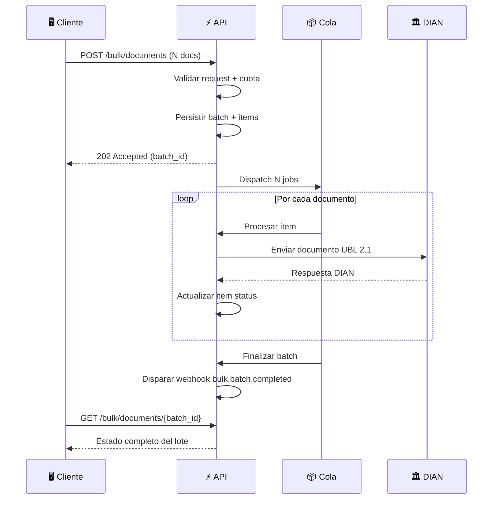

import Tabs from '@theme/Tabs';
import TabItem from '@theme/TabItem';

# Envío Masivo de Documentos (Bulk)

:::info Versión
Disponible desde **v2.10.0** · Base path: `/api/ubl2.1/bulk/documents`
:::

El endpoint de envío masivo permite procesar **múltiples documentos electrónicos** en un solo request HTTP. Los documentos se encolan para procesamiento asíncrono y puedes consultar el estado de cada uno individualmente.

---

## Flujo General



---

## Autenticación

Todos los endpoints requieren autenticación vía **Bearer Token** (Personal Access Token):

```http
Authorization: Bearer {tu-token}
```

---

## Límites por Plan

| Plan | Docs por lote | Rate Limit | Descripción |
|------|:------------:|:----------:|-------------|
| **FREE** | 5 | 1 req/min | Plan gratuito con límite diario |
| **Pago** | 50 | 10 req/min | Suscripción con cuota finita |
| **Ilimitado** | 200 | 60 req/min | Plan Servidor / Enterprise |

:::tip Personalizable
Los topes se configuran por variables de entorno (`BULK_MAX_ITEMS_FREE`, `BULK_MAX_ITEMS_PAID`, `BULK_MAX_ITEMS_UNLIMITED`) y pueden sobreescribirse por `membership_id` específico.
:::

---

## Tipos de Documento Soportados

| Valor (`kind`) | Descripción | Endpoint unitario equivalente |
|:--------------:|-------------|-------------------------------|
| `invoice` | Factura electrónica | `POST /invoices` |
| `credit_note` | Nota crédito | `POST /credit-notes` |
| `debit_note` | Nota débito | `POST /debit-notes` |
| `support_document` | Documento soporte | `POST /support-documents` |
| `adjustment_note` | Nota de ajuste | `POST /adjustment-notes` |
| `pos_document` | Documento POS electrónico | `POST /pos-documents` |

:::note Compatibilidad de payload
El `payload` de cada documento es **idéntico** al body que usarías en el endpoint unitario correspondiente. Si ya tienes integración con el endpoint unitario, puedes reutilizar el mismo JSON.
:::

---

## Endpoints

### 1. Crear Lote {#post-bulk-documents}

```http
POST /api/ubl2.1/bulk/documents
```

Acepta un lote de documentos para procesamiento asíncrono. Retorna inmediatamente con **`202 Accepted`**.

#### Headers

| Header | Tipo | Requerido | Descripción |
|--------|------|:---------:|-------------|
| `Authorization` | string | ✅ | `Bearer {token}` |
| `Content-Type` | string | ✅ | `application/json` |
| `Idempotency-Key` | UUID v4 | ❌ | Clave de idempotencia (válida 24h). Si se reenvía con el mismo payload, retorna el lote original sin reprocesar. |

#### Request Body

| Campo | Tipo | Requerido | Descripción |
|-------|------|:---------:|-------------|
| `mode` | string | ✅ | `auto-increment` o `manual`. Ver [Modos de envío](#modos-de-envío). |
| `stop_on_error` | boolean | ❌ | Si `true`, el procesamiento se detiene en el primer error. Default: `false`. |
| `default_resolution_number` | string | ❌ | Número de resolución por defecto (se inyecta en items que no lo traigan). |
| `default_prefix` | string | ❌ | Prefijo por defecto (se inyecta en items que no lo traigan). |
| `documents` | array | ✅ | Array de documentos. Mínimo 1, máximo según plan. |
| `documents[].kind` | string | ✅ | Tipo de documento. Ver [tipos soportados](#tipos-de-documento-soportados). |
| `documents[].payload` | object | ✅ | Payload del documento (mismo formato que endpoint unitario). |
| `documents[].uuid` | UUID v4 | ❌ | UUID precalculado para el documento. |
| `documents[].client_reference` | string | ❌ | Referencia del cliente para tracking (máx. 64 chars). |
| `documents[].attachments` | array | ❌ | Archivos adjuntos del documento. |

#### Ejemplos de Request

<Tabs>
<TabItem value="auto" label="Auto-increment" default>

```json
{
  "mode": "auto-increment",
  "stop_on_error": false,
  "default_resolution_number": "18764002566734",
  "default_prefix": "SETT",
  "documents": [
    {
      "kind": "invoice",
      "client_reference": "FACT-001",
      "payload": {
        "type_document_id": 1,
        "customer": {
          "identification_number": "900123456",
          "name": "Cliente Ejemplo S.A.S",
          "municipality_id": 149,
          "email": "cliente@ejemplo.com"
        },
        "legal_monetary_totals": {
          "line_extension_amount": "1000.00",
          "tax_exclusive_amount": "1000.00",
          "tax_inclusive_amount": "1190.00",
          "payable_amount": "1190.00"
        },
        "invoice_lines": [
          {
            "unit_measure_id": 70,
            "invoiced_quantity": "1",
            "line_extension_amount": "1000.00",
            "free_of_charge_indicator": false,
            "description": "Servicio de consultoría",
            "code": "SRV-001",
            "type_item_identification_id": 4,
            "price_amount": "1000.00",
            "base_quantity": "1"
          }
        ]
      }
    },
    {
      "kind": "invoice",
      "client_reference": "FACT-002",
      "payload": {
        "type_document_id": 1,
        "customer": {
          "identification_number": "800456789",
          "name": "Otro Cliente Ltda",
          "municipality_id": 149,
          "email": "otro@cliente.com"
        },
        "legal_monetary_totals": {
          "line_extension_amount": "500.00",
          "tax_exclusive_amount": "500.00",
          "tax_inclusive_amount": "595.00",
          "payable_amount": "595.00"
        },
        "invoice_lines": [
          {
            "unit_measure_id": 70,
            "invoiced_quantity": "2",
            "line_extension_amount": "500.00",
            "free_of_charge_indicator": false,
            "description": "Producto ejemplo",
            "code": "PROD-001",
            "type_item_identification_id": 4,
            "price_amount": "250.00",
            "base_quantity": "1"
          }
        ]
      }
    }
  ]
}
```

</TabItem>
<TabItem value="mixed" label="Tipos mixtos">

```json
{
  "mode": "auto-increment",
  "stop_on_error": true,
  "documents": [
    {
      "kind": "invoice",
      "client_reference": "FACT-100",
      "payload": {
        "type_document_id": 1,
        "resolution_number": "18764002566734",
        "prefix": "SETT",
        "customer": { "...": "payload completo de factura" },
        "invoice_lines": ["..."]
      }
    },
    {
      "kind": "credit_note",
      "client_reference": "NC-100",
      "payload": {
        "type_document_id": 5,
        "resolution_number": "18764002566734",
        "prefix": "NC",
        "billing_reference": {
          "number": "SETT990000001",
          "uuid": "a1b2c3d4-e5f6-7890-abcd-ef1234567890"
        },
        "customer": { "...": "payload completo de nota crédito" },
        "invoice_lines": ["..."]
      }
    },
    {
      "kind": "support_document",
      "client_reference": "DS-100",
      "payload": {
        "type_document_id": 12,
        "resolution_number": "18764002566999",
        "prefix": "SEDS",
        "customer": { "...": "payload completo de doc soporte" },
        "invoice_lines": ["..."]
      }
    }
  ]
}
```

</TabItem>
</Tabs>

#### Response `202 Accepted`

```json
{
  "success": true,
  "batch_id": "f47ac10b-58cc-4372-a567-0e02b2c3d479",
  "received": 2,
  "accepted": 2,
  "rejected": 0,
  "status": "PENDING",
  "status_url": "/api/ubl2.1/bulk/documents/f47ac10b-58cc-4372-a567-0e02b2c3d479",
  "items": [
    {
      "index": 0,
      "client_reference": "FACT-001",
      "item_id": "c1d2e3f4-a1b2-c3d4-e5f6-a7b8c9d0e1f2",
      "status": "QUEUED"
    },
    {
      "index": 1,
      "client_reference": "FACT-002",
      "item_id": "d4e5f6a7-b8c9-d0e1-f2a3-b4c5d6e7f8a9",
      "status": "QUEUED"
    }
  ],
  "estimated_completion_seconds": 12
}
```

---

### 2. Consultar Lote {#get-batch-status}

```http
GET /api/ubl2.1/bulk/documents/{batch_id}
```

Retorna el estado completo del lote con el resumen de cada item.

#### Parámetros de ruta

| Parámetro | Tipo | Descripción |
|-----------|------|-------------|
| `batch_id` | UUID | Identificador del lote (retornado en el POST) |

#### Response `200 OK`

```json
{
  "batch_id": "f47ac10b-58cc-4372-a567-0e02b2c3d479",
  "status": "COMPLETED",
  "status_description": "Completado",
  "mode": "auto-increment",
  "received": 2,
  "succeeded": 2,
  "failed": 0,
  "created_at": "2026-06-01T19:30:00+00:00",
  "finished_at": "2026-06-01T19:31:00+00:00",
  "summary": {
    "0": {
      "item_id": "c1d2e3f4-a1b2-c3d4-e5f6-a7b8c9d0e1f2",
      "index": 0,
      "kind": "invoice",
      "kind_description": "Factura electrónica",
      "client_reference": "FACT-001",
      "status": "SUCCESS",
      "status_description": "Exitoso",
      "attempts": 1,
      "processed_at": "2026-06-01T19:30:05+00:00",
      "document_number": "SETT990000001",
      "document_uuid": "a1b2c3d4-e5f6-7890-abcd-ef1234567890",
      "cufe": "abc123def456...",
      "track_id": "xyz789...",
      "dian_response": {}
    }
  }
}
```

---

### 3. Listar Items del Lote {#get-batch-items}

```http
GET /api/ubl2.1/bulk/documents/{batch_id}/items
```

Lista los items de un lote con filtros opcionales y paginación.

#### Query Parameters

| Parámetro | Tipo | Default | Descripción |
|-----------|------|:-------:|-------------|
| `status` | string | — | Filtrar: `QUEUED`, `SUCCESS`, `FAILED`, `REJECTED_BY_DIAN`, `CANCELLED` |
| `kind` | string | — | Filtrar: `invoice`, `credit_note`, `debit_note`, etc. |
| `per_page` | integer | `50` | Items por página (máx. 200) |
| `page` | integer | `1` | Número de página |

#### Response `200 OK`

```json
{
  "batch_id": "f47ac10b-58cc-4372-a567-0e02b2c3d479",
  "status": "PARTIAL",
  "items": [
    {
      "item_id": "d4e5f6a7-b8c9-d0e1-f2a3-b4c5d6e7f8a9",
      "index": 1,
      "kind": "invoice",
      "kind_description": "Factura electrónica",
      "client_reference": "FACT-002",
      "status": "FAILED",
      "status_description": "Fallido",
      "attempts": 3,
      "processed_at": "2026-06-01T19:30:18+00:00",
      "error": {
        "code": "VALIDATION_ERROR",
        "message": "El NIT del cliente no es válido."
      }
    }
  ],
  "meta": {
    "current_page": 1,
    "per_page": 10,
    "total": 1,
    "last_page": 1
  }
}
```

---

### 4. Listar Lotes {#get-batches}

```http
GET /api/ubl2.1/bulk/documents
```

Lista todos los lotes de la compañía, ordenados del más reciente al más antiguo.

#### Query Parameters

| Parámetro | Tipo | Default | Descripción |
|-----------|------|:-------:|-------------|
| `status` | string | — | Filtrar: `PENDING`, `COMPLETED`, `PARTIAL`, `FAILED` |
| `per_page` | integer | `15` | Lotes por página |
| `page` | integer | `1` | Número de página |

#### Response `200 OK`

```json
{
  "data": [
    {
      "batch_id": "f47ac10b-58cc-4372-a567-0e02b2c3d479",
      "status": "COMPLETED",
      "status_description": "Completado",
      "mode": "auto-increment",
      "received": 10,
      "succeeded": 10,
      "failed": 0,
      "created_at": "2026-06-01T19:30:00+00:00",
      "finished_at": "2026-06-01T19:31:00+00:00"
    }
  ],
  "meta": {
    "current_page": 1,
    "per_page": 15,
    "total": 1,
    "last_page": 1
  }
}
```

---

## Referencia de Estados

### Estados del Lote (`status`)

| Estado | Emoji | Descripción |
|--------|:-----:|-------------|
| `PENDING` | ⏳ | Aceptado, no ha comenzado a procesarse |
| `PROCESSING` | ⚙️ | Al menos un item está siendo procesado |
| `COMPLETED` | ✅ | Todos los items procesados exitosamente |
| `PARTIAL` | ⚠️ | Algunos exitosos, algunos fallidos |
| `FAILED` | ❌ | Todos los items fallaron |
| `CANCELLED` | 🚫 | Cancelado por `stop_on_error` |

### Estados del Item (`items[].status`)

| Estado | Emoji | Descripción |
|--------|:-----:|-------------|
| `QUEUED` | 📋 | En cola, pendiente de procesamiento |
| `PROCESSING` | ⚙️ | Siendo procesado actualmente |
| `SUCCESS` | ✅ | Procesado exitosamente ante la DIAN |
| `FAILED` | ❌ | Error en el procesamiento |
| `REJECTED_BY_DIAN` | 🏛️❌ | Enviado a DIAN pero rechazado |
| `CANCELLED` | 🚫 | Cancelado por `stop_on_error` |

---

## Idempotencia

El endpoint `POST` soporta idempotencia mediante el header **`Idempotency-Key`**.

| Escenario | Resultado |
|-----------|-----------|
| Primera vez con `Idempotency-Key` | Se crea el lote normalmente (202) |
| Mismo key + mismo payload | Se retorna el lote original sin reprocesar (202) |
| Mismo key + payload distinto | Error `409 Conflict` |
| Sin header | Cada request crea un lote nuevo |

:::warning Vigencia
El `Idempotency-Key` tiene una validez de **24 horas**. Después de ese período, el mismo key puede reutilizarse.
:::

---

## Modos de Envío

### `auto-increment`

El sistema asigna automáticamente el número de documento a partir de la resolución activa.

- Usa `default_resolution_number` y `default_prefix` a nivel de lote, o `resolution_number` y `prefix` en cada `payload`.
- Garantiza consecutivos sin huecos usando `lockForUpdate()`.
- Si un item falla, el consecutivo **no se pierde** (se marca como consumido).

### `manual`

Cada documento debe traer su propio `document_number` en el `payload`. El sistema **no** asigna consecutivos.

---

## `stop_on_error`

| Valor | Comportamiento |
|:-----:|----------------|
| `false` | Todos los documentos se procesan independientemente. Los fallos no afectan a los demás. |
| `true` | Si un documento falla, los items restantes (`QUEUED`) se cancelan con status `CANCELLED`. |

---

## Códigos de Error

| HTTP | Causa | Descripción |
|:----:|-------|-------------|
| `202` | ✅ Éxito | Lote aceptado para procesamiento |
| `402` | Cuota insuficiente | La suscripción no tiene cuota suficiente para todo el lote |
| `409` | Conflicto idempotencia | `Idempotency-Key` reutilizado con payload distinto |
| `413` | Lote muy grande | El número de documentos excede el máximo del plan |
| `422` | Validación | El request no cumple el esquema de validación |
| `429` | Rate limit | Se excedió el número de requests por minuto |

<Tabs>
<TabItem value="413" label="Error 413" default>

```json
{
  "success": false,
  "message": "El lote excede el máximo permitido para tu suscripción.",
  "max_items": 50,
  "received": 75,
  "upgrade_url": "https://tu-dominio.com/upgrade"
}
```

</TabItem>
<TabItem value="402" label="Error 402">

```json
{
  "success": false,
  "message": "Cuota insuficiente para procesar el lote completo.",
  "requested": 25
}
```

</TabItem>
<TabItem value="422" label="Error 422">

```json
{
  "message": "El campo mode es obligatorio (auto-increment o manual).",
  "errors": {
    "mode": ["El campo mode es obligatorio (auto-increment o manual)."],
    "documents.0.kind": [
      "Tipo de documento no válido. Tipos permitidos: invoice, credit_note, debit_note, support_document, adjustment_note, pos_document"
    ]
  }
}
```

</TabItem>
<TabItem value="409" label="Error 409">

```json
{
  "success": false,
  "message": "Idempotency-Key reutilizado con payload distinto."
}
```

</TabItem>
</Tabs>

---

## Webhook

Cuando un lote finaliza (todos los items en estado terminal), se dispara el evento **`bulk.batch.completed`**:

```json
{
  "event": "bulk.batch.completed",
  "data": {
    "batch_id": "f47ac10b-58cc-4372-a567-0e02b2c3d479",
    "status": "COMPLETED",
    "succeeded": 10,
    "failed": 0,
    "finished_at": "2026-06-01T19:31:00+00:00"
  }
}
```

---

## Guía Rápida de Integración

### Paso 1: Enviar el lote

```bash
curl -X POST https://tu-api.com/api/ubl2.1/bulk/documents \
  -H "Authorization: Bearer {token}" \
  -H "Content-Type: application/json" \
  -H "Idempotency-Key: 550e8400-e29b-41d4-a716-446655440000" \
  -d '{
    "mode": "auto-increment",
    "default_resolution_number": "18764002566734",
    "default_prefix": "SETT",
    "documents": [
      {
        "kind": "invoice",
        "client_reference": "MI-REF-001",
        "payload": { "...payload completo de factura..." }
      },
      {
        "kind": "invoice",
        "client_reference": "MI-REF-002",
        "payload": { "...payload completo de factura..." }
      }
    ]
  }'
```

> **Respuesta:** `202 Accepted` con `batch_id`

### Paso 2: Polling del estado

Espera unos segundos (el `estimated_completion_seconds` te da una estimación) y luego consulta:

```bash
curl -X GET https://tu-api.com/api/ubl2.1/bulk/documents/{batch_id} \
  -H "Authorization: Bearer {token}"
```

> Repite hasta que `status` sea `COMPLETED`, `PARTIAL` o `FAILED`.

### Paso 3: Consultar errores (si los hay)

```bash
curl -X GET "https://tu-api.com/api/ubl2.1/bulk/documents/{batch_id}/items?status=FAILED" \
  -H "Authorization: Bearer {token}"
```

### Paso 4: Historial de lotes

```bash
curl -X GET "https://tu-api.com/api/ubl2.1/bulk/documents?per_page=10" \
  -H "Authorization: Bearer {token}"
```

---

## Notas Técnicas

:::info Para desarrolladores
- Cada item se procesa en un **job individual** en la cola `bulk-documents` con máximo **3 reintentos** y backoff de 30 segundos.
- El procesamiento se estima en **~6 segundos por documento** (varía según latencia con DIAN).
- Los consecutivos se generan con `lockForUpdate()` para garantizar secuencialidad en concurrencia.
- El webhook `bulk.batch.completed` solo se dispara cuando **todos** los items alcanzaron un estado terminal.
:::

:::danger Límite de tamaño
El body del request no debe exceder **5 MB**. Para lotes grandes, divide en múltiples requests.
:::
